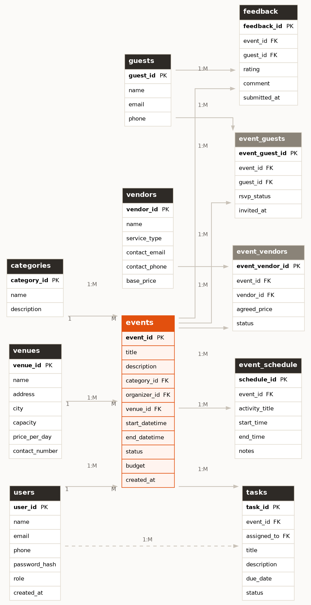

<div align="center">

# EventFlow

**A Smart Event Planning & Management System**

Plan, coordinate, and track an event from start to finish — venues, vendors, guests, tasks, and schedules, all from a single dashboard.

[](https://react.dev/)
[](https://nodejs.org/)
[](https://www.mysql.com/)
[](https://www.figma.com/)
[](https://vercel.com/)
[](#license)

</div>

---

## Table of Contents

- [Overview](#overview)
- [The Problem](#the-problem)
- [Key Features](#key-features)
- [User Roles](#user-roles)
- [Tech Stack](#tech-stack)
- [Database Schema](#database-schema)
- [Project Structure](#project-structure)
- [Getting Started](#getting-started)
- [Environment Variables](#environment-variables)
- [Available Scripts](#available-scripts)
- [Deployment](#deployment)
- [Roadmap](#roadmap)
- [Team](#team)
- [License](#license)

---

## Overview

**EventFlow** is a web-based event planning and management platform that lets organizers plan, coordinate, and track an event from start to finish — all from a single dashboard. Instead of juggling spreadsheets and group chats, an organizer books a venue, lines up vendors, invites guests, assigns tasks to staff, and builds an event-day agenda — with everything tied back to one central event record.

## The Problem

Event organizers typically rely on a mix of spreadsheets, chat apps, and paper notes to manage venues, vendors, guest lists, and tasks. This creates three recurring problems:

| Problem | Description |
|---|---|
| **Scattered tools** | Information is fragmented across platforms — nothing lives in one place. |
| **Time-consuming coordination** | Manually cross-checking schedules, RSVPs, and vendor availability is slow and error-prone. |
| **Poor visibility** | No single, real-time view of an event's status — who's confirmed, what's pending, what's left to do. |

EventFlow solves this by bringing venues, vendors, guests, tasks, and schedules into one connected system, giving organizers a single source of truth.

## Key Features

- **Event Creation & Management** — Create events with a title, category, venue, date range, budget, and live status (`planned`, `ongoing`, `completed`, `cancelled`).
- **Venue & Vendor Booking** — Browse venues by capacity and price; assign vendors (catering, décor, photography, etc.) to an event with an agreed price and booking status.
- **Guest & RSVP Management** — Invite guests and track each response — `invited`, `accepted`, `declined`, or `no_response` — per event.
- **Task Management** — Create planning tasks, assign them to staff, set due dates, and track status (`pending`, `in_progress`, `done`).
- **Event Schedule / Agenda** — Build a simple timeline of event-day activities with start/end times and notes per segment.
- **Guest Feedback** — After the event, guests can rate their experience (1–5) and leave a comment.

## User Roles

| Role | Scope |
|---|---|
| **Admin** | Oversees the platform: manages event categories and has visibility across all events and users. |
| **Organizer** | Creates and manages their own events — books venues/vendors, invites guests, assigns tasks. |
| **Staff** | Assigned tasks by an organizer; updates task status as planning work gets done. |
| **Guest** | Receives invitations, responds with an RSVP, and can leave feedback after the event. |

## Tech Stack

| Layer | Technology |
|---|---|
| **Frontend** | React.js, HTML5, CSS3, Tailwind CSS |
| **Backend** | Node.js with Express.js (REST API) |
| **Database** | MySQL 8.0+ — 11-table, 3NF relational schema |
| **UI / UX Design** | Figma — wireframes, UI kit, high-fidelity prototypes |
| **Version Control** | GitHub — repository, branches, pull requests, project board |
| **Deployment** | Vercel (frontend + CI/CD) |

## Database Schema

The system is built around **11 tables** in a simple, relational MySQL schema kept intentionally lean — no ticketing, no payments, no permissions or audit tables. The `events` table sits at the center of the schema; every other table connects back to it, either directly (1:M) or through a junction table (M:N).

<div align="center">
  
</div>

<details>
<summary><strong>Relationship summary</strong></summary>

| Relationship | Type | Notes |
|---|:---:|---|
| `users` → `events` | 1:M | One organizer creates many events |
| `users` → `tasks` | 1:M | One staff member is assigned many tasks |
| `categories` → `events` | 1:M | One category applies to many events |
| `venues` → `events` | 1:M | One venue hosts many events, at different times |
| `events` ↔ `vendors` | M:N | Via `event_vendors` — agreed price & booking status per pair |
| `events` ↔ `guests` | M:N | Via `event_guests` — RSVP status per pair |
| `events` → `tasks` | 1:M | One event has many planning tasks |
| `events` → `event_schedule` | 1:M | One event has many agenda items |
| `events` → `feedback` | 1:M | One event receives many feedback entries |
| `guests` → `feedback` | 1:M | One guest can leave feedback on multiple events |

</details>

Full column-level definitions (types, constraints, foreign keys) live in [`docs/schema/EventFlow_Database_Schema_Design.docx`](docs/schema/EventFlow_Database_Schema_Design.docx).

## Project Structure

```
eventflow/
├── client/                  # React frontend
│   ├── public/
│   ├── src/
│   │   ├── components/
│   │   ├── pages/
│   │   ├── hooks/
│   │   ├── api/              # API client wrapper
│   │   └── App.jsx
│   └── package.json
├── server/                  # Express backend
│   ├── src/
│   │   ├── routes/
│   │   ├── controllers/
│   │   ├── models/
│   │   ├── middleware/
│   │   └── config/db.js
│   ├── sql/                  # schema.sql, seed data
│   └── package.json
├── docs/
│   ├── erd/                  # entity relationship diagram
│   └── schema/                # database schema design doc
└── README.md
```

## Getting Started

### Prerequisites

- [Node.js](https://nodejs.org/) v18+
- [MySQL](https://www.mysql.com/) 8.0+
- npm or yarn

### Installation

```bash
# 1. Clone the repository
git clone https://github.com/<your-org>/eventflow.git
cd eventflow

# 2. Install backend dependencies
cd server
npm install

# 3. Install frontend dependencies
cd ../client
npm install
```

### Database Setup

```bash
# Create the database
mysql -u root -p -e "CREATE DATABASE eventflow;"

# Import the schema
mysql -u root -p eventflow < server/sql/schema.sql
```

### Run Locally

```bash
# Start the backend (from /server)
npm run dev

# Start the frontend (from /client)
npm run dev
```

The frontend will run on `http://localhost:5173` (Vite default) and the backend API on `http://localhost:5000` (adjust as configured).

## Environment Variables

Create a `.env` file in `/server` (never commit this file):

```env
PORT=5000
DB_HOST=localhost
DB_USER=root
DB_PASSWORD=your_password
DB_NAME=eventflow
JWT_SECRET=your_jwt_secret
```

Create a `.env` file in `/client`:

```env
VITE_API_BASE_URL=http://localhost:5000/api
```

## Available Scripts

| Location | Command | Description |
|---|---|---|
| `/client` | `npm run dev` | Run the React app in development mode |
| `/client` | `npm run build` | Build the frontend for production |
| `/server` | `npm run dev` | Run the Express API with hot reload |
| `/server` | `npm start` | Run the Express API in production mode |

## Deployment

- **Frontend** — deployed to [Vercel](https://vercel.com/), connected directly to this GitHub repository for automatic builds on every push to `main`.
- **Backend & Database** — the Express API and MySQL database are hosted on a Vercel-compatible / serverless-friendly provider; the frontend's API client points at the live URL via `VITE_API_BASE_URL`.

## Roadmap

Not in the current scope, but possible future extensions:

- [ ] Ticketing and payments
- [ ] Vendor reviews/ratings (separate from event feedback)
- [ ] Notifications/reminders
- [ ] Guest waitlist handling

## Team

**Team — Hold My Query**

| Name | ID |
|---|---|
| Tayyib Imam Asif | 0112430104 |
| Meyadur Rahman | 0112430460 |
| Mirza Tafhim Osman | 0112430103 |
| Ishtiaq Ahmed | 0112430164 |

## License

This project is licensed under the [MIT License](LICENSE).

---

<div align="center">

**[@holdmyquery](https://github.com/holdmyquery)**

</div>
