# EventFlow — Entity Relationship Diagram

**17 tables · 27 foreign keys**

> Generated from a live introspection of the `eventflow` database, so it matches
> [`server/sql/schema.sql`](../../server/sql/schema.sql) exactly. Column-level
> definitions (types, defaults, delete rules, indexes) are in
> [`../schema/EventFlow_Schema.md`](../schema/EventFlow_Schema.md).

GitHub renders the diagram below directly. The same source also lives in
[`EventFlow_ERD.mmd`](EventFlow_ERD.mmd) — paste it into
[mermaid.live](https://mermaid.live) to export a PNG/SVG for a report.

## How to read it

- `||--o{` — the child **must** have a parent (`NOT NULL` foreign key)
- `|o--o{` — the child **may** have a parent (nullable foreign key)
- `PK` primary key · `FK` foreign key · `UK` unique column

```mermaid
erDiagram
    %% ---- Reference & identity ----
    users {
        int user_id PK
        varchar name
        varchar email UK
        varchar phone "nullable"
        varchar password_hash
        enum role
        timestamp created_at "nullable"
    }
    venues {
        int venue_id PK
        varchar name
        varchar address
        varchar city
        int capacity
        decimal price_per_day
        varchar contact_number "nullable"
    }
    vendors {
        int vendor_id PK
        varchar name
        varchar service_type
        varchar contact_email "nullable"
        varchar contact_phone "nullable"
        decimal base_price "nullable"
    }
    categories {
        int category_id PK
        varchar name UK
        varchar description "nullable"
    }
    guests {
        int guest_id PK
        varchar name
        varchar email "nullable"
        varchar phone "nullable"
        varchar description "nullable"
        enum guest_type
    }
    %% ---- Core record ----
    events {
        int event_id PK
        varchar title
        text description "nullable"
        int category_id FK "nullable"
        int organizer_id FK
        int venue_id FK "nullable"
        datetime start_datetime
        datetime end_datetime
        enum status "nullable"
        decimal budget "nullable"
        timestamp created_at "nullable"
    }
    %% ---- Event dependents & junctions ----
    event_guests {
        int event_guest_id PK
        int event_id FK
        int guest_id FK
        enum rsvp_status "nullable"
        timestamp invited_at "nullable"
        varchar token UK "nullable"
        tinyint rsvp_locked
    }
    event_vendors {
        int event_vendor_id PK
        int event_id FK
        int vendor_id FK
        decimal agreed_price
        enum status "nullable"
    }
    tasks {
        int task_id PK
        int event_id FK
        int assigned_to FK "nullable"
        varchar title
        text description "nullable"
        date due_date "nullable"
        enum status "nullable"
    }
    task_feedback {
        int task_feedback_id PK
        int task_id FK
        int staff_id FK
        enum stage
        text comment
        timestamp submitted_at "nullable"
        tinyint is_read
        tinyint completed_marker "generated, nullable"
    }
    event_schedule {
        int schedule_id PK
        int event_id FK
        varchar activity_title
        time start_time
        time end_time "nullable"
        varchar notes "nullable"
    }
    feedback {
        int feedback_id PK
        int event_id FK
        int guest_id FK
        tinyint rating
        text comment "nullable"
        timestamp submitted_at "nullable"
    }
    %% ---- Payment ledgers & workflow ----
    venue_bookings {
        int booking_id PK
        int event_id FK
        int venue_id FK
        int organizer_id FK
        decimal total_price
        decimal deposit_amount
        enum status
        varchar tran_id UK
        varchar val_id "nullable"
        timestamp paid_at "nullable"
        timestamp overdue_alert_sent_at "nullable"
        timestamp created_at "nullable"
    }
    vendor_bookings {
        int booking_id PK
        int event_id FK
        int vendor_id FK
        int organizer_id FK
        decimal agreed_price
        decimal deposit_amount
        enum status
        varchar tran_id UK
        varchar val_id "nullable"
        timestamp paid_at "nullable"
        timestamp overdue_alert_sent_at "nullable"
        timestamp created_at "nullable"
    }
    balance_payments {
        int booking_id PK
        enum booking_type
        int source_booking_id
        int event_id FK
        int organizer_id FK
        decimal amount
        enum status
        varchar tran_id UK
        varchar val_id "nullable"
        timestamp paid_at "nullable"
        timestamp created_at "nullable"
        tinyint paid_marker "generated, nullable"
    }
    event_creation_fees {
        int booking_id PK
        int organizer_id FK
        int event_id FK "nullable"
        decimal amount
        enum status
        varchar tran_id UK
        varchar val_id "nullable"
        json payload
        timestamp paid_at "nullable"
        timestamp created_at "nullable"
    }
    event_cancellation_requests {
        int request_id PK
        int event_id FK
        int organizer_id FK
        text reason
        enum status
        int reviewed_by FK "nullable"
        text review_note "nullable"
        timestamp requested_at "nullable"
        timestamp reviewed_at "nullable"
        tinyint pending_marker "generated, nullable"
    }

    %% ---- relationships (27 foreign keys) ----
    events ||--o{ balance_payments : "One event may owe several balances"
    users ||--o{ balance_payments : "One organizer settles many balances"
    events ||--o{ event_cancellation_requests : "One event may be the subject of several requests over time"
    users ||--o{ event_cancellation_requests : "Organizer files the request"
    users |o--o{ event_cancellation_requests : "Admin reviews and decides the request"
    users ||--o{ event_creation_fees : "One organizer pays many platform fees"
    events |o--o{ event_creation_fees : "The fee row that created the event"
    events ||--o{ event_guests : "One event has many invitations"
    guests ||--o{ event_guests : "One guest is invited to many events"
    events ||--o{ event_schedule : "One event has many agenda items"
    events ||--o{ event_vendors : "One event has many hired vendors"
    vendors ||--o{ event_vendors : "One vendor is hired for many events"
    categories |o--o{ events : "One category applies to many events"
    users ||--o{ events : "One organizer creates many events"
    venues |o--o{ events : "One venue hosts many events, at different times"
    events ||--o{ feedback : "One event receives many feedback entries"
    guests ||--o{ feedback : "One guest can leave feedback on multiple events"
    tasks ||--o{ task_feedback : "One task collects many staff notes"
    users ||--o{ task_feedback : "One staff member writes many task notes"
    events ||--o{ tasks : "One event has many planning tasks"
    users |o--o{ tasks : "One staff member is assigned many tasks"
    events ||--o{ vendor_bookings : "One event may hire several vendors"
    vendors ||--o{ vendor_bookings : "One vendor accumulates many hires"
    users ||--o{ vendor_bookings : "One organizer pays for many vendor hires"
    events ||--o{ venue_bookings : "One event may go through several venue checkouts"
    venues ||--o{ venue_bookings : "One venue accumulates many bookings"
    users ||--o{ venue_bookings : "One organizer pays for many venue bookings"
```

## Design notes

- **`events` is the hub.** Every other table reaches it directly or through a junction.
- **Two many-to-many pairs:** `events` ↔ `guests` via `event_guests` (RSVP state + invite token) and `events` ↔ `vendors` via `event_vendors` (agreed price + status).
- **Guests are not users.** `guests` has no password and no login; a guest acts only through the random `event_guests.token` in their emailed RSVP link.
- **Four payment ledgers, one pattern.** `venue_bookings`, `vendor_bookings`, `balance_payments` and `event_creation_fees` each hold an SSLCommerz transaction (`tran_id`, `val_id`, `status`, `paid_at`). Deposits are 10%; `balance_payments` settles the remaining 90% after the event.
- **`balance_payments.source_booking_id` is polymorphic** — it points at `venue_bookings` or `vendor_bookings` depending on `booking_type`, which is why it carries no foreign key.
- **Generated marker columns enforce "only one of X".** `task_feedback.completed_marker`, `balance_payments.paid_marker` and `event_cancellation_requests.pending_marker` are `NULL` except in the one state that must be unique — since MySQL ignores `NULL`s in a unique index, this allows unlimited other rows while making that one state exclusive.
